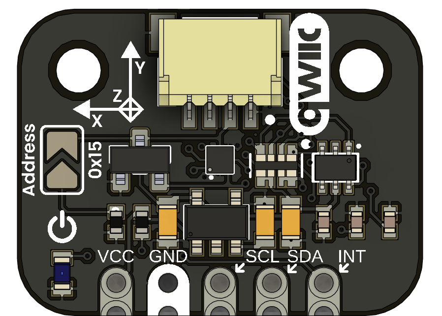

# UNIT BMM350 Magnetometer I3C Module

  
  
<em>BMM350 Magnetometer</em>

The **UNIT BMM350 Magnetometer I3C Module** is a compact and efficient magnetometer designed for magnetic field sensing. It utilizes the BMM350 sensor from Bosch, which supports I3C communication for fast data transfer and low power consumption. I3C is a modern communication protocol that allows multiple devices to be connected on the same bus, making it ideal for applications requiring multiple sensors.

## 📦 Overview

| Feature                | Description                                                   |
|------------------------|---------------------------------------------------------------|
| Sensor                 | BMM350 Magnetometer                                           |
| Communication Protocol | I3C                                                          |
| Power Supply           | 3.3V or 5V                                                    |

## 🧪 Use Cases

- **Magnetic Field Sensing**: Ideal for applications requiring precise magnetic field measurements.
- **Navigation Systems**: Can be used in conjunction with other sensors for accurate positioning.
- **Robotics**: Useful in robotic applications for orientation and navigation.
- **Consumer Electronics**: Can be integrated into smartphones, tablets, and wearables for enhanced functionality.

## 🚀 Getting Started

1. **Connect** the board via USB-C to your computer.
2. **Install** the appropriate board package for:
   - Arduino IDE
   - PlatformIO
   - ESP-IDF / Pico SDK
3. **Flash** a sample project or use one from `/software/examples`
4. **Power** via USB or external battery (if supported)

## 📚 Resources

- [Schematic Diagram](hardware/schematic.pdf)
- [Board Dimensions (DXF)](docs/dimensions.dxf)
- [Pinout Diagram](docs/pinout.png)
- [Firmware Examples](firmware/)
- [Getting Started Guide](docs/getting_started.md)

## 📝 License

All hardware and documentation in this project are licensed under the **MIT License**.  
Please refer to [`LICENSE.md`](LICENSE.md) for full terms.

  Template created by UNIT Electronics

